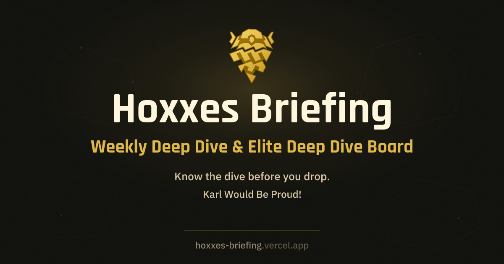
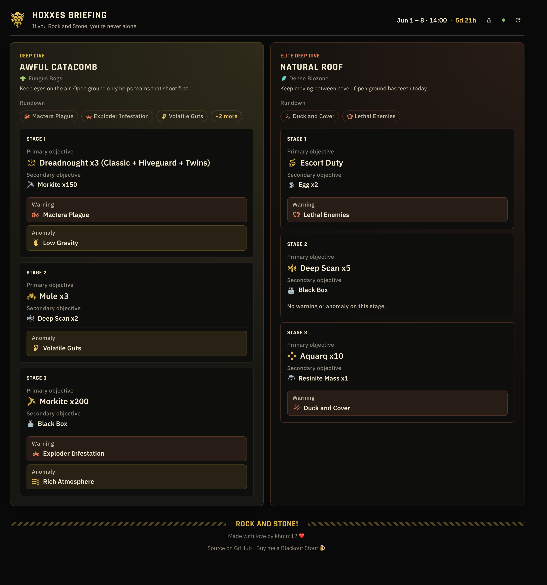
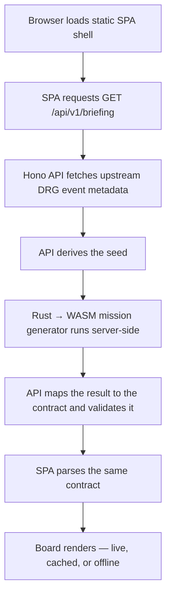

<div align="center">



# Hoxxes Briefing

**The weekly Deep Rock Galactic Deep Dive and Elite Deep Dive, at a glance.**

[](https://github.com/khmm12/hoxxes-briefing/actions/workflows/ci.yml)
[](https://hoxxes-briefing.vercel.app)
[](LICENSE)

[**Open the board →**](https://hoxxes-briefing.vercel.app)

</div>

---

> What are we dealing with this week, and when does it reset?

Hoxxes Briefing answers that one question fast. No wiki dive, no dashboard, no
login — just an industrial mission board for Hoxxes IV that you can scan under
pressure and keep reading when you're offline.

<div align="center">



<sub><i>The live board — Deep Dive and Elite Deep Dive, biome, timing, and every stage's objectives, warnings, and anomalies at a glance.</i></sub>

</div>

## What's on the board

- 🗺️ **Both dives, side by side** — the current Deep Dive and Elite Deep Dive,
  with the normal dive never treated as an afterthought.
- ⏳ **Timing up front** — start, end, and time remaining until the weekly reset.
- 🎯 **Every stage, decoded** — biome plus primary and secondary objective,
  warning, and anomaly (mutator) for all three stages of each dive.
- 📡 **Freshness you can trust** — live, cached, or stale is always labeled, and a
  background refresh swaps in newer data without blanking the board you're reading.
- 📴 **Offline-readable** — a PWA that keeps showing the last briefing when the
  network drops, and a clear state when there's nothing cached yet.
- 📱 **Phone-first and themed** — compact, warm, rough, and operational, without
  drowning the mission data in decoration.

## How it works

The briefing is generated server-side from upstream Deep Rock Galactic event
metadata and the same mission generator the game uses, compiled from Rust to
WebAssembly. Web and API only ever talk through one closed, validated wire
contract.



Wire data crosses a closed [valibot](https://valibot.dev) contract in both
directions: closed enums, no freeform strings for bounded domains, and both ends
reject the unknown. New domain values are a deliberate contract revision, caught
at build time rather than papered over at runtime. See
[docs/architecture.md](docs/architecture.md) for the full shape.

## Tech stack

| Layer          | Built with                                                                 |
| -------------- | -------------------------------------------------------------------------- |
| Web SPA        | [SolidJS](https://solidjs.com) 2 (beta), [Panda CSS](https://panda-css.com), [Lingui](https://lingui.dev) i18n, Embla, PWA / Workbox |
| API            | [Hono](https://hono.dev) on Vercel Functions                               |
| Wire contract  | [valibot](https://valibot.dev) shared schemas                              |
| Generation     | Rust mission generator → WebAssembly                                        |
| Build & tooling| [Vite](https://vite.dev), pnpm workspaces, [mise](https://mise.jdx.dev), [Biome](https://biomejs.dev), Vitest, cargo |

Exact versions live in the `package.json` and `Cargo.toml` files — this table
names the tech, not the pins.

## Quickstart

Install the repo toolchain and dependencies:

```bash
mise install
corepack enable
pnpm install
```

Run the local app in two terminals:

```bash
pnpm dev:api
```

```bash
pnpm dev:web
```

The web dev server runs on `http://127.0.0.1:5173` and proxies `/api/*` to the
local API.

## Commands

```bash
pnpm build   # build every workspace package
pnpm test    # TypeScript + Rust test suites
pnpm check   # the full gate: Biome + typecheck + rustfmt + clippy + test + build
```

Regenerate the committed WASM package after Rust generator changes:

```bash
./scripts/codegen-wasm.sh
```

## Repository

- `apps/web/` — Solid SPA, PWA shell, and public UI
- `apps/api/` — Hono API and server-side orchestration
- `packages/contracts/` — shared API schemas and parsing helpers
- `crates/` — Rust generator facade and WASM bridge
- `api/` — Vercel Function entrypoints
- `designs/` — Pencil mockups and the design-system spec

## Documentation

- [Architecture](docs/architecture.md) — system shape and data flow
- [Product](docs/product.md) — product and UX intent
- [Design System](designs/DESIGN.md) — tokens, typography roles, components, motion
- [Ubiquitous Language](CONTEXT.md) — canonical domain terms and deliberate deviations
- [Domain Reference](docs/domain.md) — Deep Rock Galactic catalogue and contract enums
- [Contract Runbook](docs/contract-runbook.md) — evolving the wire contract (revisions, seasons)
- [Deployment](docs/deployment.md) — Vercel deployment runbook
- [Web App](apps/web/README.md) — web app ownership and local notes

## Contributing

- Use [Conventional Commits](https://www.conventionalcommits.org/) for commit messages.
- Prefer small, focused commits with one logical change per commit.
- Run `pnpm check` before opening a PR.
- Do not include AI/tool attribution in commit messages unless explicitly requested.

## Credits

This project would not be here without the mission generation work started in
[trumank/drg-mission-gen](https://github.com/trumank/drg-mission-gen) and carried
forward through the [vioxynteris fork](https://github.com/vioxynteris/deepdives)
that Hoxxes Briefing currently depends on.

Rock and Stone to every miner who left a flare in the dark.

## License

MIT © [khmm12](https://github.com/khmm12). See [`LICENSE`](LICENSE).
